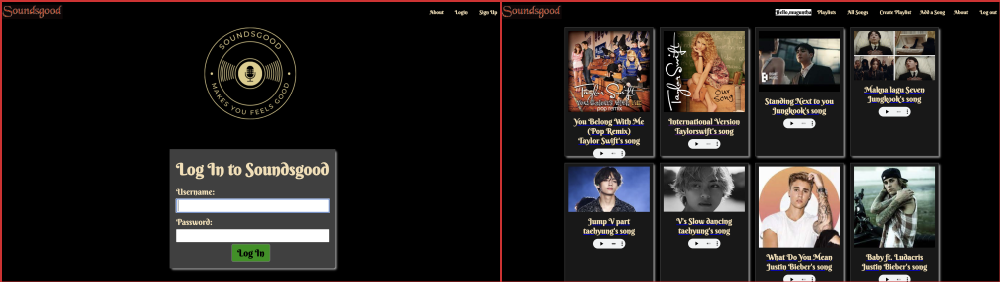

# Soundsgood
## Project Description:
Soundsgood is a versatile digital tool that empowers music enthusiasts to curate and manage their own personalized collections of songs. Users can create, edit, and organize playlists to suit their moods, occasions, or preferences.
# Planning Material
The planning materials are available on the Trello board linked [here](https://trello.com/b/RpsXkxkw/soundsgood), which contains the project's user stories, ERD, and wireframes.
# Installation :[Soundsgood](https://soundsgood.fly.dev/)
## Technologies && Database :

## Resources :
- Google Chrome
- W3Schools
- MDN web Docs
- [Google fonts](https://fonts.google.com/specimen/Libre+Baskerville)
- Lunapic
-Stack Overflow
## Tools and Services :
  
 
 
 
## Next Steps / Icebox :
- Add autoplay options to play the song.
- Customize the audio player.
- Shuffle the songs.
- Allow users to add a favorites songs and show in the home page
- Show recently played songs on the home page.
- Allow users to replay a song.